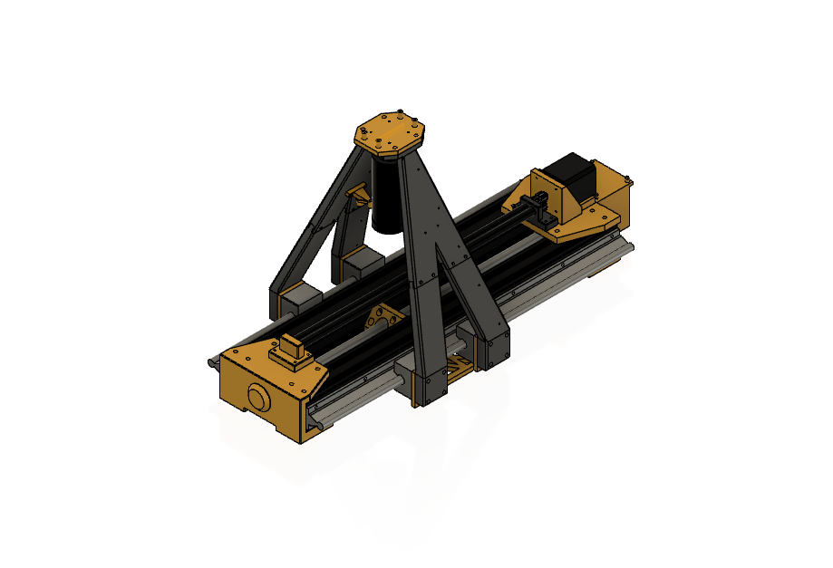

This is a quality control tool I designed and built that uses the Ultralytics YOLOv8 computer vision AI model to detect manufactured defects in cylindrical parts similar to laser-cut hypotubes. Traditionally, laser-cut hypotubes are rolled back and forth manually to detect manufacturing defects. This predictable motion is required to perform quality control (QC) on the majority of laser-cut hypotubes. This process is tedious and repetitive for QC operators. By utilizing a tool that scans the entirety of a part and outputs potential defects with a confidence score, operators could spend more time performing other essential tasks.

I began the design process by defining necessary functions and performing a trade-off analysis for each. After determining a few fundamental components, including the aluminum extrusions, linear rails, and ball screw mechanism, I chose to begin designing the assembly. During this time, I mistakenly overlooked defining a few off-the-shelf (OTS) components, which led to the initial prototype having a slight case of “cable spaghetti.” At this point in the design, I had already done some research on the general software stack I was planning to use. After manufacturing the remaining components and assembling them, I began developing the software.

The program is fairly simple. The host computer defines program parameters and uses PySerial to send movement commands to an Arduino microcontroller operating two NEMA 17 stepper motors: one controlling the camera gantry, the other controlling two steel rollers that rotate the part. Image capture commands are sent to a Raspberry Pi camera acting as a USB camera. After all images are captured, they are reformatted, and the detection model iterates through the images. Finally, all detections are outputted to the user with annotations and confidence scores.

Acknowledgments

<a href="https://docs.ultralytics.com">Ultralytics Yolov8</a>    
<a href="https://github.com/computervisioneng/train-yolov8-custom-dataset-step-by-step-guide">train-yolov8-custom-dataset-step-by-step-guide</a>    
<a href="https://www.raspberrypi.com/tutorials/plug-and-play-raspberry-pi-usb-webcam/">plug-and-play-raspberry-pi-usb-webcam</a>  
<a href="https://www.raspberrypi.com/news/how-to-build-your-own-raspberry-pi-webcam">how-to-build-your-own-raspberry-pi-webcam</a>  

<a href="https://github.com/grbl/grbl">GRBL</a> 

<a href="https://github.com/grbl/grbl/wiki/Configuring-Grbl-v0.9">Configuring-Grbl-v0.9</a>

