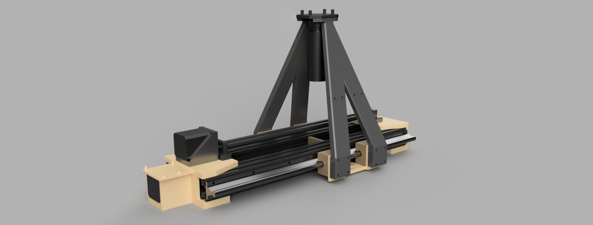

I

Quality control is outdated!

The Automated Hypotube Inspector is a prototype tool designed to automate manufacturing defect detection in catheter manufacturing (CM). Currently, quality control (QC) in CM requires technicians to visually inspect 100% of the parts to ensure no manufacturing defects are present. This is a time-consuming task that this prototype solves.

Software Design - The machine utilizes three computers.
1) host computer
2) Arduino R3
3) Raspberry Pi W 2

First, the host computer executes main.py. The script initializes a serial connection with the Arduino microcontroller running GRBL, an open-source motion control software. The Arduino controls all motion for both the rollers and the camera gantry. The host computer calculates how far to move the camera gantry in each section and begins sending motion commands to the Arduino. Once the motion command has been executed, an image is captured by the Raspberry Pi and sent to a directory on the host computer. The Raspberry Pi is running custom firmware that configures it to be recognized as a USB camera. Once all images have been captured, they are reformatted to a uniform size, and a YOLOv8 detection algorithm is iterated throughout the image directory. Finally, the program opens a popup window containing images of all the detections and outputs the number of detections in the terminal.

Usage:

 1.   Place the part on the stage.
 2.   Connect the Raspberry Pi and Arduino to the computer via USB.
 3.   Ensure camera functionality by opening the camera program on the host computer and waiting for feedback.
 4.   Open the main.py program and adjust the "ser" variable parameter for COM to match the location of the Arduino.
 5.   Adjust the part_length and part_diameter variables inside main.py (Units: mm).
 6.   Save and close main.py.
 7.   Run main.py.
 8.   The number of detections will be output in the terminal, and a popup window will open with the annotated images.

Acknowledgments

<a href="https://docs.ultralytics.com">Ultralytics Yolov8</a>    
<a href="https://github.com/computervisioneng/train-yolov8-custom-dataset-step-by-step-guide">train-yolov8-custom-dataset-step-by-step-guide</a>    
<a href="https://www.raspberrypi.com/tutorials/plug-and-play-raspberry-pi-usb-webcam/">plug-and-play-raspberry-pi-usb-webcam</a>  
<a href="https://www.raspberrypi.com/news/how-to-build-your-own-raspberry-pi-webcam">how-to-build-your-own-raspberry-pi-webcam</a>  

<a href="https://github.com/grbl/grbl">GRBL</a> 

<a href="https://github.com/grbl/grbl/wiki/Configuring-Grbl-v0.9">Configuring-Grbl-v0.9</a>

